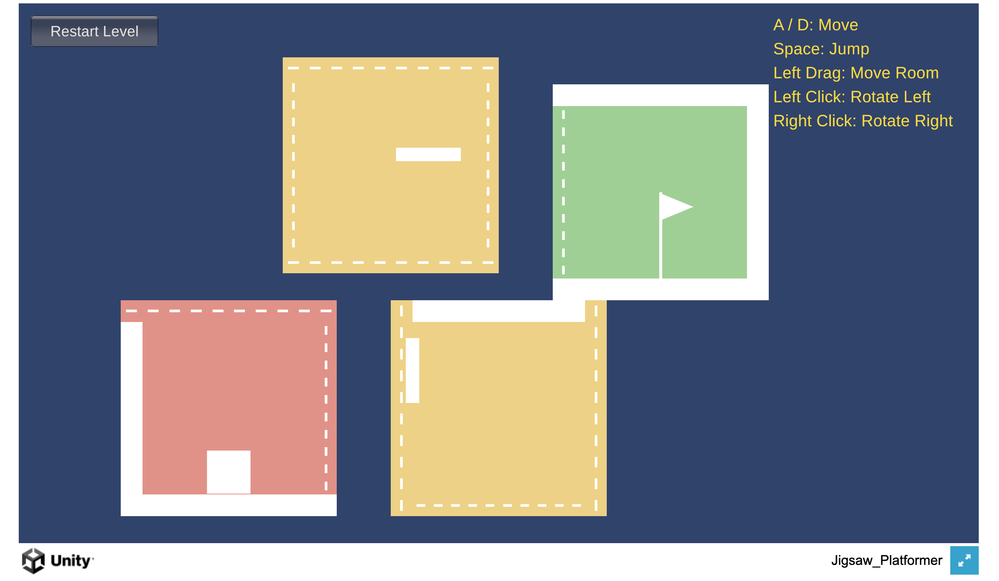

## Jigsaw Platformer

[Play in Browser](https://csci-526.github.io/Team9-Li_Llanillo_Liwag/)

Jigsaw Platformer is a 2D puzzle-platformer in which players rearrange and rotate rooms to create a path from a fixed starting room to a fixed goal room. Players connect matching open gates, then move and jump across the platforms inside. Movable rooms can be dragged while unoccupied and rotated in 90-degree increments, even with the player inside. Gravity always pulls downward, so rotating a room changes which surfaces serve as floors, walls, and platforms. Reaching the goal requires combining room manipulation with platforming.

